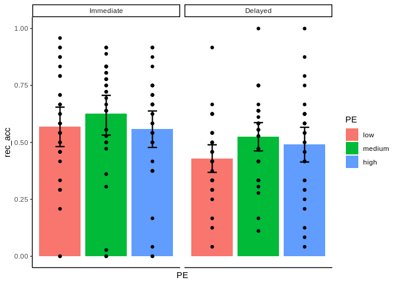
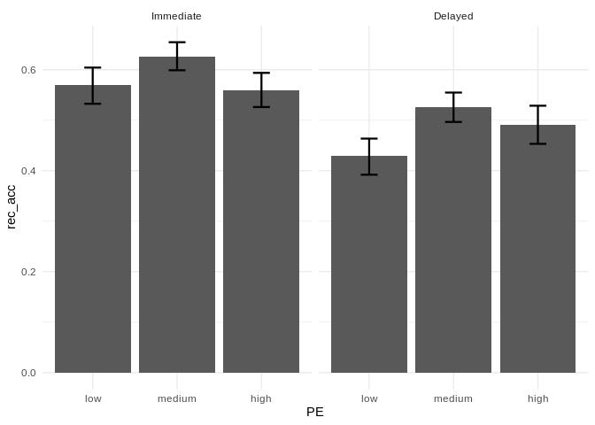

-   [Let’s Plot the data](#lets-plot-the-data)
    -   [First, retrieve and inspection the
        data](#first-retrieve-and-inspection-the-data)
    -   [Now the plot](#now-the-plot)
    -   [Alternative plot, without
        colors](#alternative-plot-without-colors)
        -   [But it is a bit sad, isn’t
            it?](#but-it-is-a-bit-sad-isnt-it)
-   [MLM analysis](#mlm-analysis)

Let’s Plot the data
===================

First, retrieve and inspection the data
---------------------------------------

In order to use ggplot and to analyse the data with MLMs, we need to
have data arranged in a long format. Contrarily to a wide format, were
every row represents a participant, in a long format dataset each row
corresponds to an observation.

``` r
# retrieve data
data<-read.csv("DataLong.csv")

# snapshot of the first part of the dataset
print(data[1:10,])
```

    ##    particip_code rec_session     PE rec_acc
    ## 1              1           2 medium       0
    ## 2              1           1    low       0
    ## 3              1           1   high       0
    ## 4              1           2   high       0
    ## 5              1           1   high       0
    ## 6              1           1   high       0
    ## 7              1           2 medium       0
    ## 8              1           2 medium       0
    ## 9              1           2 medium       0
    ## 10             1           2    low       0

``` r
# this is a long format

# set the the order of the levels of PE. This is important for plotting
data$PE<-factor(data$PE, levels=c("low", "medium", "high"))

# rename the levels of the rec_session to "immediate" and "delayed"
# first, let's convert from numeric to factor
data$rec_session<-as.factor(data$rec_session)

# now rename the levels
levels(data$rec_session)<-c("Immediate", "Delayed")

print(data[1:10,])
```

    ##    particip_code rec_session     PE rec_acc
    ## 1              1     Delayed medium       0
    ## 2              1   Immediate    low       0
    ## 3              1   Immediate   high       0
    ## 4              1     Delayed   high       0
    ## 5              1   Immediate   high       0
    ## 6              1   Immediate   high       0
    ## 7              1     Delayed medium       0
    ## 8              1     Delayed medium       0
    ## 9              1     Delayed medium       0
    ## 10             1     Delayed    low       0

Now the plot
------------

``` r
library(ggplot2)
```

    ## Warning: replacing previous import 'vctrs::data_frame' by 'tibble::data_frame'
    ## when loading 'dplyr'

``` r
ggplot(data, aes(PE, rec_acc))+ geom_bar(aes(PE, rec_acc, fill = PE),
    position="dodge",stat="summary")+
stat_summary(fun.data = "mean_cl_boot", size = 0.8, geom="errorbar", width=0.2 )+ # this line adds error bars
theme_classic()+ # changing the default theme
facet_grid(.~rec_session)+ # split the graphs orizontally according to rec_session
theme(axis.text.x = element_blank())+ # we are showing the different levels through the colors, so we can avoid naming the bars
theme(axis.ticks.x = element_blank()) # and we can remove the ticks
```



Alternative plot, without colors
--------------------------------

``` r
ggplot(data, aes(PE, rec_acc))+ geom_bar(aes(PE, rec_acc),
    position="dodge",stat="summary")+
facet_grid(.~rec_session)+ # split the graphs orizontally according to rec_session
stat_summary(fun.data = "mean_cl_boot", size = 0.8, geom="errorbar", width=0.2 )+ 
theme_minimal()
```



### But it is a bit sad, isn’t it?

MLM analysis
============

Now we want to analyse the data using MLMs, in order to model random
slopes and intercepts for participants.

``` r
library(dplyr) # package to summarise and aggregate data. I use it to have descriptive statistics
```

    ## 
    ## Attaching package: 'dplyr'

    ## The following objects are masked from 'package:stats':
    ## 
    ##     filter, lag

    ## The following objects are masked from 'package:base':
    ## 
    ##     intersect, setdiff, setequal, union

``` r
library(lme4) # package that contains the formula for MLMs
```

    ## Loading required package: Matrix

``` r
library(car)
```

    ## Loading required package: carData

    ## Registered S3 methods overwritten by 'car':
    ##   method                          from
    ##   influence.merMod                lme4
    ##   cooks.distance.influence.merMod lme4
    ##   dfbeta.influence.merMod         lme4
    ##   dfbetas.influence.merMod        lme4

    ## 
    ## Attaching package: 'car'

    ## The following object is masked from 'package:dplyr':
    ## 
    ##     recode

``` r
# First, let's get some descriptives

data %>%
  group_by ( rec_session, PE) %>%
  summarise(mean=mean(rec_acc, na.rm=T))
```

    ## `summarise()` regrouping output by 'rec_session' (override with `.groups` argument)

``` r
# now analyse
# we are using glmer function (generalised linear mixed model) because our dependent variable (recognition accuracy) is binary. For this reason, 
# we also specify the "binomial" link function. We are looking for an interaction between PE and the session. Data are repeated in the two rec_sessions and nester
# within participants. Thus, we are including random intercepts for participants, and random slopes for rec_session and PE. 
MLMmodel<- glmer(rec_acc~PE*rec_session+(rec_session*PE|particip_code), family= binomial, data=data)
```

    ## boundary (singular) fit: see ?isSingular

``` r
summary(MLMmodel)

# Here the results for the different levels of PE are shown in the form of contrasts

# We could use "Anova" from the "car" package to get the overall effect of PE (Wald Chi-square)
Anova(MLMmodel)
```
