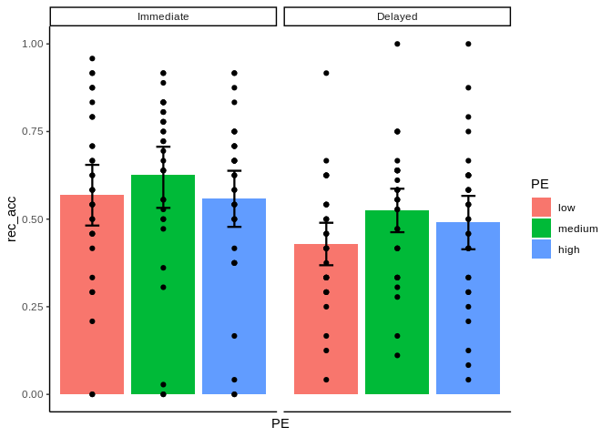

-   [What are Multilevel Models?](#what-are-multilevel-models)
    -   [First, retrieve and inspection the
        data](#first-retrieve-and-inspection-the-data)
    -   [MLM analysis](#mlm-analysis)

What are Multilevel Models?
===========================

Multilevel models are special cases of linear mixed models where the
data structure is nested, meaning that every data point (level 1) appear
in only one level of higher-level variable (level-2). Examples are kids
(level 1) nested in schools (level 2) or patients in clinics. In
cogntive psychology studies, the level 1 is usually represented by the
single observations which are nested whithin participants. In contrast
to a general linear model, where a model is fit for the entire group, in
multilevel models we fit one model for each cluster (or participant, in
our case). This is achieved by using **random effects**, namely effects
that vary from cluster to cluster (or between participants). These
effects are usually random intercepts and random slopes, that are
assumed to vary between participants in our sample as in the general
population.

First, retrieve and inspection the data
---------------------------------------

In order to use ggplot and to analyse the data with MLMs, we need to
have data arranged in a long format. Contrarily to a wide format, were
every row represents a participant, in a long format dataset each row
corresponds to an observation.

``` r
# retrieve data
data<-read.csv("DataLongObj.csv")

# snapshot of the first part of the dataset
print(data[1:10,])
```

    ##    particip_code rec_session     PE rec_acc       rec_Obj
    ## 1              1           2 medium       0     harmonica
    ## 2              1           1    low       0     glassmop2
    ## 3              1           1   high       0         harp2
    ## 4              1           2   high       0   musicsheet2
    ## 5              1           1   high       0 ironingboard2
    ## 6              1           1   high       0   garbagebin2
    ## 7              1           2 medium       0       garlic2
    ## 8              1           2 medium       0          leek
    ## 9              1           2 medium       0         flute
    ## 10             1           2    low       0          laud

``` r
# this is a long format

# set the the order of the levels of PE. This is important for plotting
data$PE<-factor(data$PE, levels=c("low", "medium", "high"))

# rename the levels of the rec_session to "immediate" and "delayed"
# first, let's convert from numeric to factor
data$rec_session<-as.factor(data$rec_session)

# now rename the levels
levels(data$rec_session)<-c("Immediate", "Delayed")

print(data[1:10,])
```

    ##    particip_code rec_session     PE rec_acc       rec_Obj
    ## 1              1     Delayed medium       0     harmonica
    ## 2              1   Immediate    low       0     glassmop2
    ## 3              1   Immediate   high       0         harp2
    ## 4              1     Delayed   high       0   musicsheet2
    ## 5              1   Immediate   high       0 ironingboard2
    ## 6              1   Immediate   high       0   garbagebin2
    ## 7              1     Delayed medium       0       garlic2
    ## 8              1     Delayed medium       0          leek
    ## 9              1     Delayed medium       0         flute
    ## 10             1     Delayed    low       0          laud

Now the plot

``` r
library(ggplot2)
```

    ## Warning: replacing previous import 'vctrs::data_frame' by 'tibble::data_frame'
    ## when loading 'dplyr'

``` r
library(dplyr) # package to summarise and aggregate data. I use it to have descriptive statistics
 
# to plot the performance, let' aggregate at the participant level, so each point represent a participant
data$particip_code<-as.factor(data$particip_code)

datasub<-group_by ( data, particip_code, PE, rec_session)%>%
  summarise(rec_acc= mean(rec_acc, na.rm=T))

ggplot(datasub, aes(PE, rec_acc))+
  geom_bar(aes(PE, rec_acc, fill = PE),
           position="dodge",stat="summary")+
  geom_point()+
  stat_summary(fun.data = "mean_cl_boot", size = 0.8, geom="errorbar", width=0.2 )+ # this line adds error bars
  theme_classic()+ # changing the default theme
  facet_grid(.~rec_session)+ # split the graphs orizontally according to rec_session
  theme(axis.text.x = element_blank())+ # we are showing the different levels through the colors, so we can avoid naming the bars
  theme(axis.ticks.x = element_blank()) # and we can remove the ticks
```



Alternative plot, without colors

``` r
ggplot(data, aes(PE, rec_acc))+ geom_bar(aes(PE, rec_acc),
                                         position="dodge",stat="summary")+
  geom_point()~
  facet_grid(.~rec_session)+ # split the graphs orizontally according to rec_session
  stat_summary(fun.data = "mean_cl_boot", size = 0.8, geom="errorbar", width=0.2 )+ 
  theme_minimal()
```

But it is a bit sad, isn’t it?

MLM analysis
------------

Now we want to analyse the data using MLMs, in order to model random
slopes and intercepts for participants.

``` r
library(lme4) # package that contains the formula for MLMs
library(car)

# First, let's get some descriptives

data %>%
  group_by ( rec_session, PE) %>%
  summarise(mean=mean(rec_acc, na.rm=T))
```

    ## # A tibble: 6 x 3
    ## # Groups:   rec_session [2]
    ##   rec_session PE      mean
    ##   <fct>       <fct>  <dbl>
    ## 1 Immediate   low    0.570
    ## 2 Immediate   medium 0.626
    ## 3 Immediate   high   0.559
    ## 4 Delayed     low    0.430
    ## 5 Delayed     medium 0.526
    ## 6 Delayed     high   0.491

Now analyse. Description of the R syntax for MLM can be found
[here](https://gitlab.com/Soph87/LISCOlab/-/blob/master/MLM%20Analysis/interpret_output.pdf)

``` r
# we are using glmer function (generalised linear mixed model) because our dependent variable (recognition accuracy) is binary. For this reason, 
# we also specify the "binomial" link function. We could also call the model "Multilevel generalized linear models"
# We are looking for an interaction between PE and the session. Data are repeated in the two rec_sessions and nested
# within participants. Thus, we are including random intercepts for participants, and random slopes for rec_session and PE, as well as randon slopes for their interaction. 
MLMmodel<- glmer(rec_acc~PE*rec_session+(rec_session*PE|particip_code), family= binomial, data=data)
summary(MLMmodel)
```

    ## Generalized linear mixed model fit by maximum likelihood (Laplace
    ##   Approximation) [glmerMod]
    ##  Family: binomial  ( logit )
    ## Formula: rec_acc ~ PE * rec_session + (rec_session * PE | particip_code)
    ##    Data: data
    ## 
    ##      AIC      BIC   logLik deviance df.resid 
    ##   6545.7   6723.6  -3245.9   6491.7     5349 
    ## 
    ## Scaled residuals: 
    ##     Min      1Q  Median      3Q     Max 
    ## -3.3785 -0.9026  0.3659  0.8036  3.7504 
    ## 
    ## Random effects:
    ##  Groups        Name                        Variance Std.Dev. Corr             
    ##  particip_code (Intercept)                 2.35249  1.5338                    
    ##                rec_sessionDelayed          2.96666  1.7224   -0.90            
    ##                PEmedium                    0.10719  0.3274   -0.21  0.40      
    ##                PEhigh                      0.13557  0.3682   -0.63  0.90  0.47
    ##                rec_sessionDelayed:PEmedium 0.04902  0.2214    0.29 -0.34 -0.95
    ##                rec_sessionDelayed:PEhigh   0.09614  0.3101    0.72 -0.58  0.50
    ##             
    ##             
    ##             
    ##             
    ##             
    ##  -0.28      
    ##  -0.35 -0.46
    ## Number of obs: 5376, groups:  particip_code, 32
    ## 
    ## Fixed effects:
    ##                              Estimate Std. Error z value Pr(>|z|)  
    ## (Intercept)                  0.181209   0.288006   0.629   0.5292  
    ## PEmedium                     0.328195   0.132237   2.482   0.0131 *
    ## PEhigh                       0.005379   0.140372   0.038   0.9694  
    ## rec_sessionDelayed          -0.488775   0.328948  -1.486   0.1373  
    ## PEmedium:rec_sessionDelayed  0.103703   0.159884   0.649   0.5166  
    ## PEhigh:rec_sessionDelayed    0.262589   0.175664   1.495   0.1350  
    ## ---
    ## Signif. codes:  0 '***' 0.001 '**' 0.01 '*' 0.05 '.' 0.1 ' ' 1
    ## 
    ## Correlation of Fixed Effects:
    ##             (Intr) PEmedm PEhigh rc_ssD PEm:_D
    ## PEmedium    -0.312                            
    ## PEhigh      -0.485  0.541                     
    ## rc_sssnDlyd -0.888  0.358  0.571              
    ## PEmdm:rc_sD  0.251 -0.768 -0.399 -0.350       
    ## PEhgh:rc_sD  0.377 -0.284 -0.677 -0.415  0.469
    ## convergence code: 0
    ## boundary (singular) fit: see ?isSingular

``` r
# Here the results for the different levels of PE are shown in the form of contrasts

# We could use "Anova" from the "car" package to get the overall effect of PE (Wald Chi-square)
Anova(MLMmodel)
```

    ## Analysis of Deviance Table (Type II Wald chisquare tests)
    ## 
    ## Response: rec_acc
    ##                  Chisq Df Pr(>Chisq)    
    ## PE             23.1948  2   9.19e-06 ***
    ## rec_session     0.9633  1     0.3264    
    ## PE:rec_session  2.2381  2     0.3266    
    ## ---
    ## Signif. codes:  0 '***' 0.001 '**' 0.01 '*' 0.05 '.' 0.1 ' ' 1

Interpretation of this output can be found
[here](https://gitlab.com/Soph87/LISCOlab/-/blob/master/MLM%20Analysis/interpret_output.pdf)
