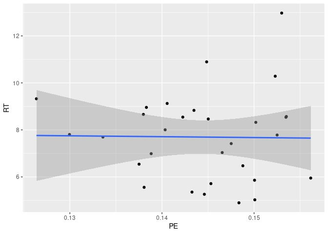
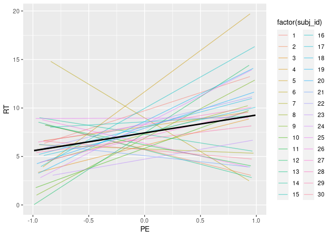

-   [Load packages](#load-packages)
-   [Simulate data](#simulate-data)
-   [Aggregate](#aggregate)
-   [Unconditional model, random
    intercepts](#unconditional-model-random-intercepts)
-   [Test significance of random
    intercepts](#test-significance-of-random-intercepts)
-   [Simulation-based LRT](#simulation-based-lrt)
-   [Maximal model](#maximal-model)
-   [Centering](#centering)
-   [How much variance does our predictor explain on level 1 and
    2](#how-much-variance-does-our-predictor-explain-on-level-1-and-2)
-   [Model selection backward](#model-selection-backward)
-   [Excercise1](#excercise1)
-   [Categorical predictor between](#categorical-predictor-between)
-   [Setting contrasts](#setting-contrasts)
-   [Continuous predictor between](#continuous-predictor-between)
-   [Categorical predictor within.
    EZ](#categorical-predictor-within.-ez)
-   [Categorical predictor within:
    mixed-effects](#categorical-predictor-within-mixed-effects)
-   [excercise2](#excercise2)
-   [logistic regression simulate
    files](#logistic-regression-simulate-files)
-   [Extra](#extra)
-   [plot the regression line and confidence intervals taking into
    account random
    effects](#plot-the-regression-line-and-confidence-intervals-taking-into-account-random-effects)

Load packages
=============

``` r
# load the packages and source functions
library(dplyr)
library(ggplot2)
library(lme4)
library(lmerTest)
library(RLRsim)
source("helper_functions/simulateData.R")
# suppress scientific notation
options(scipen=5)
```

Simulate data
=============

``` r
# set.seed
set.seed(1234)
df<-my_sim_data(   
  SubN = 30,
  beta_0 = 0.60, # grand mean (fixed intercept)
  PEmean = 0.30,# PEmean
  beta_PE = 1.28, # effect of PE (fixed slope)
  n_items = 300, # number of trials
  tau_0 = 1.80, # by-subject random intercept sd .Check if it is sd, because than it will be squared into variance
  tau_1 = 2.50, # by-subject random slope sd
  rho = 0.3, # correlation between intercept and slope
  sigma = 0.3, # residual standard deviation
  RTorACC = 1 # Reaction times or accuracy (1 = RT, 2 = accuracy)
  )

# show first row of simulated data
head(df)
```

    ## # A tibble: 6 x 8
    ## # Groups:   subj_id [1]
    ##   subj_id  T_0s  T_1s item_id     PE     e_si    RT PElevel
    ##     <int> <dbl> <dbl>   <int>  <dbl>    <dbl> <dbl>   <dbl>
    ## 1       1  2.42  2.44     280 -0.390  0.391    8.68       2
    ## 2       1  2.42  2.44     152  0.492 -0.196   11.4        3
    ## 3       1  2.42  2.44     239  0.226 -0.00506 10.6        2
    ## 4       1  2.42  2.44     184  0.249 -0.170   10.5        2
    ## 5       1  2.42  2.44     109  0.121 -0.338    9.85       2
    ## 6       1  2.42  2.44     118 -0.554 -0.555    7.13       2

Aggregate
=========

``` r
# We are assuming that RT are normally distributed

# aggregate RT at the subject level
df_agg<-df %>%
  group_by(subj_id) %>%
  summarise(RT=mean(RT), PE=mean(PE)) 

# plot 
ggplot(df_agg, aes(y=RT, x = PE))+
  geom_point()+
  geom_smooth(method="lm")
```

    ## `geom_smooth()` using formula 'y ~ x'



``` r
# simple regression
linearmod<-lm(RT~PE, data = df_agg)

# get the summary
summary(linearmod)
```

    ## 
    ## Call:
    ## lm(formula = RT ~ PE, data = df_agg)
    ## 
    ## Residuals:
    ##     Min      1Q  Median      3Q     Max 
    ## -2.7819 -1.5765  0.0868  0.9321  5.3083 
    ## 
    ## Coefficients:
    ##             Estimate Std. Error t value Pr(>|t|)
    ## (Intercept)    8.233      7.024   1.172    0.251
    ## PE            -3.730     48.573  -0.077    0.939
    ## 
    ## Residual standard error: 1.905 on 28 degrees of freedom
    ## Multiple R-squared:  0.0002105,  Adjusted R-squared:  -0.0355 
    ## F-statistic: 0.005897 on 1 and 28 DF,  p-value: 0.9393

Unconditional model, random intercepts
======================================

``` r
# first, let's run an intercept only, unconditional model
mixmod_unc<-lmer(RT~1+(1|subj_id), data = df, control=lmerControl(optimizer="bobyqa"))#,optCtrl=list(maxfun=100000)))

summary(mixmod_unc)
```

    ## Linear mixed model fit by REML. t-tests use Satterthwaite's method [
    ## lmerModLmerTest]
    ## Formula: RT ~ 1 + (1 | subj_id)
    ##    Data: df
    ## Control: lmerControl(optimizer = "bobyqa")
    ## 
    ## REML criterion at convergence: 38252
    ## 
    ## Scaled residuals: 
    ##     Min      1Q  Median      3Q     Max 
    ## -4.5976 -0.5385  0.0698  0.5965  3.5325 
    ## 
    ## Random effects:
    ##  Groups   Name        Variance Std.Dev.
    ##  subj_id  (Intercept) 3.493    1.869   
    ##  Residual             4.030    2.008   
    ## Number of obs: 9000, groups:  subj_id, 30
    ## 
    ## Fixed effects:
    ##             Estimate Std. Error      df t value Pr(>|t|)    
    ## (Intercept)   7.6947     0.3419 29.0000   22.51   <2e-16 ***
    ## ---
    ## Signif. codes:  0 '***' 0.001 '**' 0.01 '*' 0.05 '.' 0.1 ' ' 1

``` r
# calculate the intraclass correlation
ICC<-VarCorr(mixmod_unc)$subj_id[1]/(VarCorr(mixmod_unc)$subj_id[1]+summary(mixmod_unc)$sigma^2)

# paste the results
paste("The IntraClass Correlation is",  ICC)
```

    ## [1] "The IntraClass Correlation is 0.464271789380495"

Test significance of random intercepts
======================================

``` r
# test significance
# model without random intercept. We can create a random intercept that is constant at 1
df$constint<-rep(1, nrow(df))

mod_unc<-lm(RT~1, data=df)
mixmod_unc<-lmer(RT~1+(1|subj_id), data = df)

anova(mixmod_unc, mod_unc)
```

    ## refitting model(s) with ML (instead of REML)

    ## Data: df
    ## Models:
    ## mod_unc: RT ~ 1
    ## mixmod_unc: RT ~ 1 + (1 | subj_id)
    ##            npar   AIC   BIC logLik deviance  Chisq Df Pr(>Chisq)    
    ## mod_unc       2 43566 43580 -21781    43562                         
    ## mixmod_unc    3 38258 38279 -19126    38252 5310.3  1  < 2.2e-16 ***
    ## ---
    ## Signif. codes:  0 '***' 0.001 '**' 0.01 '*' 0.05 '.' 0.1 ' ' 1

Simulation-based LRT
====================

``` r
# use simulation based-test
exactLRT(mixmod_unc,mod_unc)
```

    ## No restrictions on fixed effects. REML-based inference preferable.

    ## Using likelihood evaluated at REML estimators.

    ## Please refit model with method="ML" for exact results.

    ## 
    ##  simulated finite sample distribution of LRT. (p-value based on 10000
    ##  simulated values)
    ## 
    ## data:  
    ## LRT = 5310.3, p-value < 2.2e-16

Maximal model
=============

``` r
# plot
  ggplot(df, aes(y=RT, x = PE))+
  geom_line(stat="smooth", method= "lm", formula = y~x, alpha = 0.5)+aes(colour = factor(subj_id))+
  geom_smooth(method="lm", colour="black")
```

    ## `geom_smooth()` using formula 'y ~ x'



``` r
maxMod<-lmer(RT~PE+(1+PE|subj_id), data = df, control=lmerControl(optimizer="bobyqa"))
summary(maxMod)
```

    ## Linear mixed model fit by REML. t-tests use Satterthwaite's method [
    ## lmerModLmerTest]
    ## Formula: RT ~ PE + (1 + PE | subj_id)
    ##    Data: df
    ## Control: lmerControl(optimizer = "bobyqa")
    ## 
    ## REML criterion at convergence: 4179.7
    ## 
    ## Scaled residuals: 
    ##     Min      1Q  Median      3Q     Max 
    ## -3.3829 -0.6809  0.0004  0.6715  3.6142 
    ## 
    ## Random effects:
    ##  Groups   Name        Variance Std.Dev. Corr
    ##  subj_id  (Intercept)  2.50371 1.5823       
    ##           PE          12.62806 3.5536   0.44
    ##  Residual              0.08771 0.2962       
    ## Number of obs: 9000, groups:  subj_id, 30
    ## 
    ## Fixed effects:
    ##             Estimate Std. Error      df t value Pr(>|t|)    
    ## (Intercept)   7.4325     0.2889 28.9999  25.726  < 2e-16 ***
    ## PE            1.8175     0.6488 29.0001   2.801  0.00897 ** 
    ## ---
    ## Signif. codes:  0 '***' 0.001 '**' 0.01 '*' 0.05 '.' 0.1 ' ' 1
    ## 
    ## Correlation of Fixed Effects:
    ##    (Intr)
    ## PE 0.438

``` r
anova(maxMod)
```

    ## Type III Analysis of Variance Table with Satterthwaite's method
    ##     Sum Sq Mean Sq NumDF DenDF F value   Pr(>F)   
    ## PE 0.68828 0.68828     1    29  7.8469 0.008972 **
    ## ---
    ## Signif. codes:  0 '***' 0.001 '**' 0.01 '*' 0.05 '.' 0.1 ' ' 1

Centering
=========

``` r
# grand mean centring and person mean centring
df<- df %>%
  # Grand mean centering (GMC)
  mutate (PE.gmc = PE-mean(PE)) %>%
  # Person mean centering (centering withing clusters - Participants)
  group_by(subj_id) %>%
  mutate(PE.cm = mean(PE),
         PE.cwc = PE-PE.cm ) %>%
  ungroup %>%
  # grand mean centering of the aggregated variable
  mutate(PE.cmc= PE.cm-mean(PE.cm))


maxModCent<-lmer(RT~PE.cwc+PE.cmc+(1+PE.cwc|subj_id), data = df, control=lmerControl(optimizer="bobyqa"))
summary(maxModCent)
```

    ## Linear mixed model fit by REML. t-tests use Satterthwaite's method [
    ## lmerModLmerTest]
    ## Formula: RT ~ PE.cwc + PE.cmc + (1 + PE.cwc | subj_id)
    ##    Data: df
    ## Control: lmerControl(optimizer = "bobyqa")
    ## 
    ## REML criterion at convergence: 4170.9
    ## 
    ## Scaled residuals: 
    ##     Min      1Q  Median      3Q     Max 
    ## -3.3829 -0.6809  0.0003  0.6716  3.6142 
    ## 
    ## Random effects:
    ##  Groups   Name        Variance Std.Dev. Corr
    ##  subj_id  (Intercept)  3.57840 1.8917       
    ##           PE.cwc      12.62807 3.5536   0.64
    ##  Residual              0.08771 0.2962       
    ## Number of obs: 9000, groups:  subj_id, 30
    ## 
    ## Fixed effects:
    ##             Estimate Std. Error      df t value Pr(>|t|)    
    ## (Intercept)   7.6947     0.3454 28.6405  22.279  < 2e-16 ***
    ## PE.cwc        1.8175     0.6488 29.0001   2.801  0.00897 ** 
    ## PE.cmc       -2.1428    37.0993 28.0000  -0.058  0.95435    
    ## ---
    ## Signif. codes:  0 '***' 0.001 '**' 0.01 '*' 0.05 '.' 0.1 ' ' 1
    ## 
    ## Correlation of Fixed Effects:
    ##        (Intr) PE.cwc
    ## PE.cwc 0.639        
    ## PE.cmc 0.000  0.000

How much variance does our predictor explain on level 1 and 2
=============================================================

``` r
## R^2pseudo:within
# we create a new model including PE grand mean centered (PE_gmc) as preditor for RT
ModPE<-lmer(RT~PE.gmc+(1|subj_id), data = df, control=lmerControl(optimizer="bobyqa"))
summary(ModPE)
```

    ## Linear mixed model fit by REML. t-tests use Satterthwaite's method [
    ## lmerModLmerTest]
    ## Formula: RT ~ PE.gmc + (1 | subj_id)
    ##    Data: df
    ## Control: lmerControl(optimizer = "bobyqa")
    ## 
    ## REML criterion at convergence: 36120.8
    ## 
    ## Scaled residuals: 
    ##     Min      1Q  Median      3Q     Max 
    ## -4.1898 -0.5273  0.0013  0.4899  4.9925 
    ## 
    ## Random effects:
    ##  Groups   Name        Variance Std.Dev.
    ##  subj_id  (Intercept) 3.496    1.870   
    ##  Residual             3.177    1.782   
    ## Number of obs: 9000, groups:  subj_id, 30
    ## 
    ## Fixed effects:
    ##               Estimate Std. Error         df t value Pr(>|t|)    
    ## (Intercept)    7.69472    0.34187   29.00002   22.51   <2e-16 ***
    ## PE.gmc         1.84276    0.03753 8968.99999   49.11   <2e-16 ***
    ## ---
    ## Signif. codes:  0 '***' 0.001 '**' 0.01 '*' 0.05 '.' 0.1 ' ' 1
    ## 
    ## Correlation of Fixed Effects:
    ##        (Intr)
    ## PE.gmc 0.000

``` r
# used to quantify the change in (within) residual variance 
# variance residuum m0 - variance residuum m1 / variance residuum m0 = 1- Variance residuum m1/variance residuum m0
1 - summary(ModPE)$sigma^2/summary(mixmod_unc)$sigma^2
```

    ## [1] 0.2118037

``` r
## R^2pseudo:between
# Variance Intercept modunc - Variance ModPE/Variance mixmod_unc = 1-Variance ModPE/Variance mixmod_unc
1 - VarCorr(ModPE)$subj_id[1]/VarCorr(mixmod_unc)$subj_id[1]
```

    ## [1] -0.0008137963

``` r
## R^2pseudo:bw (between and within)
# explained variance of each model = variance intercept + residual variance
# R^2pseudo:bw = 1-(Var.intercept ModPE + Var.residuum ModPE)/(Var. intercept mixedmod_unc + Var. Residuum mixedmod_unc)
1 - (VarCorr(ModPE)$subj_id[1] + summary(ModPE)$sigma^2)/(VarCorr(mixmod_unc)$subj_id[1] + summary(mixmod_unc)$sigma^2)
```

    ## [1] 0.1130914

``` r
## if we want to include random slopes, we need to consider these sources of variances as well in our calculation
```

Model selection backward
========================

``` r
# fit a model with covariance of random effects set at zero
maxModZeroCov<-lmer(RT~PE+PE+(PE||subj_id), data = df, control=lmerControl(optimizer="bobyqa"))

summary(maxModZeroCov)
```

    ## Linear mixed model fit by REML. t-tests use Satterthwaite's method [
    ## lmerModLmerTest]
    ## Formula: RT ~ PE + PE + (PE || subj_id)
    ##    Data: df
    ## Control: lmerControl(optimizer = "bobyqa")
    ## 
    ## REML criterion at convergence: 4185.9
    ## 
    ## Scaled residuals: 
    ##     Min      1Q  Median      3Q     Max 
    ## -3.3830 -0.6811  0.0001  0.6721  3.6143 
    ## 
    ## Random effects:
    ##  Groups    Name        Variance Std.Dev.
    ##  subj_id   (Intercept)  2.50377 1.5823  
    ##  subj_id.1 PE          12.62840 3.5536  
    ##  Residual               0.08771 0.2962  
    ## Number of obs: 9000, groups:  subj_id, 30
    ## 
    ## Fixed effects:
    ##             Estimate Std. Error      df t value Pr(>|t|)    
    ## (Intercept)   7.4325     0.2889 28.9999  25.726  < 2e-16 ***
    ## PE            1.8175     0.6488 29.0000   2.801  0.00897 ** 
    ## ---
    ## Signif. codes:  0 '***' 0.001 '**' 0.01 '*' 0.05 '.' 0.1 ' ' 1
    ## 
    ## Correlation of Fixed Effects:
    ##    (Intr)
    ## PE 0.000

``` r
# let's compare
anova(maxMod, maxModZeroCov )
```

    ## refitting model(s) with ML (instead of REML)

    ## Data: df
    ## Models:
    ## maxModZeroCov: RT ~ PE + PE + (PE || subj_id)
    ## maxMod: RT ~ PE + (1 + PE | subj_id)
    ##               npar    AIC    BIC  logLik deviance  Chisq Df Pr(>Chisq)  
    ## maxModZeroCov    5 4196.2 4231.7 -2093.1   4186.2                       
    ## maxMod           6 4191.8 4234.4 -2089.9   4179.8 6.3997  1    0.01141 *
    ## ---
    ## Signif. codes:  0 '***' 0.001 '**' 0.01 '*' 0.05 '.' 0.1 ' ' 1

Excercise1
==========

``` r
# baseline model
# m0 <- 

# random effects
# m1 <-

# make it more complex  
# m2 <-
```

Categorical predictor between
=============================

``` r
# create a categorical predictor between, simulating that we are randomly assigning participants
# to different groups of PE
PEbet<-rep(c("HighPE", "LowPE", "MediumPE"), each= nrow(df_agg)/3)

# created the levels in the aggregated dataset
  # pick random subject
set.seed(1234)
  df_agg$PEbw<-sample(PEbet, nrow(df_agg), replace = F)
  
  # we want it as factor
  df_agg$PEbw<-as.factor(df_agg$PEbw)

  # descriptives
df_agg %>%
  group_by(PEbw) %>%
  summarise(mean=mean(RT), sd = sd(RT))
```

    ## # A tibble: 3 x 3
    ##   PEbw      mean    sd
    ## * <fct>    <dbl> <dbl>
    ## 1 HighPE    8.43  2.26
    ## 2 LowPE     6.77  1.41
    ## 3 MediumPE  7.89  1.62

``` r
# plot 
ggplot(df_agg, aes(PEbw, RT))+
  geom_bar(aes(PEbw, RT, fill = PEbw),
           position="dodge",stat="summary")+
  geom_point()+
  stat_summary(fun.data = "mean_cl_boot", size = 0.8, geom="errorbar", width=0.2 )# this line adds error bars
```

    ## No summary function supplied, defaulting to `mean_se()`


``` r
# create an Anova between participant
bwlm<-lm(RT~PEbw, data=df_agg)

summary(bwlm)
```

    ## 
    ## Call:
    ## lm(formula = RT ~ PEbw, data = df_agg)
    ## 
    ## Residuals:
    ##     Min      1Q  Median      3Q     Max 
    ## -3.1649 -1.3796  0.2879  1.0118  4.5457 
    ## 
    ## Coefficients:
    ##              Estimate Std. Error t value Pr(>|t|)    
    ## (Intercept)    8.4254     0.5690  14.807 1.76e-14 ***
    ## PEbwLowPE     -1.6553     0.8047  -2.057   0.0495 *  
    ## PEbwMediumPE  -0.5368     0.8047  -0.667   0.5104    
    ## ---
    ## Signif. codes:  0 '***' 0.001 '**' 0.01 '*' 0.05 '.' 0.1 ' ' 1
    ## 
    ## Residual standard error: 1.799 on 27 degrees of freedom
    ## Multiple R-squared:  0.1403, Adjusted R-squared:  0.07659 
    ## F-statistic: 2.203 on 2 and 27 DF,  p-value: 0.13

``` r
# re-level in order to have medium as the reference level
df_agg$PEbw<-relevel(df_agg$PEbw, ref = "MediumPE")

# refit
bwlm<-lm(RT~PEbw, data=df_agg)

summary(bwlm)
```

    ## 
    ## Call:
    ## lm(formula = RT ~ PEbw, data = df_agg)
    ## 
    ## Residuals:
    ##     Min      1Q  Median      3Q     Max 
    ## -3.1649 -1.3796  0.2879  1.0118  4.5457 
    ## 
    ## Coefficients:
    ##             Estimate Std. Error t value Pr(>|t|)    
    ## (Intercept)   7.8886     0.5690  13.864 8.52e-14 ***
    ## PEbwHighPE    0.5368     0.8047   0.667    0.510    
    ## PEbwLowPE    -1.1184     0.8047  -1.390    0.176    
    ## ---
    ## Signif. codes:  0 '***' 0.001 '**' 0.01 '*' 0.05 '.' 0.1 ' ' 1
    ## 
    ## Residual standard error: 1.799 on 27 degrees of freedom
    ## Multiple R-squared:  0.1403, Adjusted R-squared:  0.07659 
    ## F-statistic: 2.203 on 2 and 27 DF,  p-value: 0.13

``` r
anova(bwlm)
```

    ## Analysis of Variance Table
    ## 
    ## Response: RT
    ##           Df Sum Sq Mean Sq F value Pr(>F)
    ## PEbw       2 14.264  7.1318  2.2027   0.13
    ## Residuals 27 87.418  3.2377

Setting contrasts
=================

``` r
# method 1: contrast poly
contrasts(df_agg$PEbw)<-contr.poly(3) # we have three levels in our categorical predictor

# refit the model
bwlmContr<-lm(RT~PEbw, data=df_agg)

summary(bwlmContr)
```

    ## 
    ## Call:
    ## lm(formula = RT ~ PEbw, data = df_agg)
    ## 
    ## Residuals:
    ##     Min      1Q  Median      3Q     Max 
    ## -3.1649 -1.3796  0.2879  1.0118  4.5457 
    ## 
    ## Coefficients:
    ##             Estimate Std. Error t value Pr(>|t|)    
    ## (Intercept)   7.6947     0.3285  23.423   <2e-16 ***
    ## PEbw.L       -0.7909     0.5690  -1.390    0.176    
    ## PEbw.Q       -0.8949     0.5690  -1.573    0.127    
    ## ---
    ## Signif. codes:  0 '***' 0.001 '**' 0.01 '*' 0.05 '.' 0.1 ' ' 1
    ## 
    ## Residual standard error: 1.799 on 27 degrees of freedom
    ## Multiple R-squared:  0.1403, Adjusted R-squared:  0.07659 
    ## F-statistic: 2.203 on 2 and 27 DF,  p-value: 0.13

``` r
# set our own contrasts
# linear
contrast1<-c(-1,0,1)
# quadratic
contrast2<-c(1,-2,1)


contrasts(df_agg$PEbw)<-cbind(contrast1, contrast2)
  
# refit the model
bwlmContrCust<-lm(RT~PEbw, data=df_agg)

summary(bwlmContrCust)               
```

    ## 
    ## Call:
    ## lm(formula = RT ~ PEbw, data = df_agg)
    ## 
    ## Residuals:
    ##     Min      1Q  Median      3Q     Max 
    ## -3.1649 -1.3796  0.2879  1.0118  4.5457 
    ## 
    ## Coefficients:
    ##               Estimate Std. Error t value Pr(>|t|)    
    ## (Intercept)     7.6947     0.3285  23.423   <2e-16 ***
    ## PEbwcontrast1  -0.5592     0.4023  -1.390    0.176    
    ## PEbwcontrast2  -0.3654     0.2323  -1.573    0.127    
    ## ---
    ## Signif. codes:  0 '***' 0.001 '**' 0.01 '*' 0.05 '.' 0.1 ' ' 1
    ## 
    ## Residual standard error: 1.799 on 27 degrees of freedom
    ## Multiple R-squared:  0.1403, Adjusted R-squared:  0.07659 
    ## F-statistic: 2.203 on 2 and 27 DF,  p-value: 0.13

Continuous predictor between
============================

``` r
# what if we convert the categorical into continuous?
df_agg$PEbwC<-as.vector(NA)

for (n in 1:nrow(df_agg)){
  if (df_agg$PEbw[n]=="MediumPE"){
  df_agg$PEbwC[n]<-0.33
  } else if (df_agg$PEbw[n] == "HighPE"){
    df_agg$PEbwC[n]<-0.80
  }  else if (df_agg$PEbw[n] == "LowPE"){
    df_agg$PEbwC[n]<-0.20
  }
}

ggplot(df_agg, aes(y=RT, x = PEbwC))+
  geom_point()+
  geom_smooth(method="lm")
```

    ## `geom_smooth()` using formula 'y ~ x'


``` r
# fit lm
bwlmC<-lm(RT~PEbwC, data=df_agg)

summary(bwlmC)
```

    ## 
    ## Call:
    ## lm(formula = RT ~ PEbwC, data = df_agg)
    ## 
    ## Residuals:
    ##     Min      1Q  Median      3Q     Max 
    ## -3.2640 -1.5243  0.2769  1.1990  4.4465 
    ## 
    ## Coefficients:
    ##             Estimate Std. Error t value Pr(>|t|)    
    ## (Intercept)   6.6632     0.6545  10.180 6.48e-11 ***
    ## PEbwC         2.3267     1.2764   1.823    0.079 .  
    ## ---
    ## Signif. codes:  0 '***' 0.001 '**' 0.01 '*' 0.05 '.' 0.1 ' ' 1
    ## 
    ## Residual standard error: 1.802 on 28 degrees of freedom
    ## Multiple R-squared:  0.1061, Adjusted R-squared:  0.07416 
    ## F-statistic: 3.323 on 1 and 28 DF,  p-value: 0.07901

Categorical predictor within. EZ
================================

``` r
# we have a categorical variable in the dataset, which is PElevel
df$PElevel<-as.factor(df$PElevel)

# let's inspect that
  ggplot(df, aes(y=RT, x = PElevel))+
  geom_boxplot( )
```


``` r
# eazy anova on the aggregate dataset
df_aggbw<-df %>%
          group_by(subj_id,PElevel) %>%
          summarise(RT=mean(RT))
```

    ## `summarise()` has grouped output by 'subj_id'. You can override using the `.groups` argument.

``` r
head(df_aggbw)
```

    ## # A tibble: 6 x 3
    ## # Groups:   subj_id [2]
    ##   subj_id PElevel    RT
    ##     <int> <fct>   <dbl>
    ## 1       1 1        6.93
    ## 2       1 2        8.76
    ## 3       1 3       11.9 
    ## 4       2 1        7.68
    ## 5       2 2        6.35
    ## 6       2 3        4.12

``` r
# ezanova
library(ez)
```

    ## Registered S3 methods overwritten by 'car':
    ##   method                          from
    ##   influence.merMod                lme4
    ##   cooks.distance.influence.merMod lme4
    ##   dfbeta.influence.merMod         lme4
    ##   dfbetas.influence.merMod        lme4

``` r
ezModel<-ezANOVA(data = df_aggbw, # dataframe
                 dv = .(RT), # dependent variable. This functions requires to place the name of each variable within .() 
                 wid = .(subj_id), # variable that identifies participants )
                 within = .(PElevel), # independent variable
                 detailed = T
                 )
```

    ## Warning: Converting "subj_id" to factor for ANOVA.

``` r
ezModel
```

    ## $ANOVA
    ##        Effect DFn DFd        SSn      SSd          F            p p<.05
    ## 1 (Intercept)   1  29 4649.02600 182.0397 740.617464 3.377350e-22     *
    ## 2     PElevel   2  58   93.06356 334.9127   8.058349 8.162931e-04     *
    ##         ges
    ## 1 0.8999314
    ## 2 0.1525592
    ## 
    ## $`Mauchly's Test for Sphericity`
    ##    Effect           W            p p<.05
    ## 2 PElevel 0.002235943 7.806401e-38     *
    ## 
    ## $`Sphericity Corrections`
    ##    Effect       GGe       p[GG] p[GG]<.05       HFe       p[HF] p[HF]<.05
    ## 2 PElevel 0.5005596 0.008167513         * 0.5006196 0.008165235         *

Categorical predictor within: mixed-effects
===========================================

``` r
# 
ModCateg<-lmer(RT~PElevel+(PElevel|subj_id), data = df, control=lmerControl(optimizer="bobyqa"))
```

    ## boundary (singular) fit: see ?isSingular

``` r
summary(ModCateg)
```

    ## Linear mixed model fit by REML. t-tests use Satterthwaite's method [
    ## lmerModLmerTest]
    ## Formula: RT ~ PElevel + (PElevel | subj_id)
    ##    Data: df
    ## Control: lmerControl(optimizer = "bobyqa")
    ## 
    ## REML criterion at convergence: 25596
    ## 
    ## Scaled residuals: 
    ##     Min      1Q  Median      3Q     Max 
    ## -4.0859 -0.5149 -0.0259  0.4480  5.1094 
    ## 
    ## Random effects:
    ##  Groups   Name        Variance Std.Dev. Corr       
    ##  subj_id  (Intercept)  6.070   2.4638              
    ##           PElevel2     3.960   1.9899   -0.81      
    ##           PElevel3    22.960   4.7916   -0.82  1.00
    ##  Residual              0.963   0.9813              
    ## Number of obs: 9000, groups:  subj_id, 30
    ## 
    ## Fixed effects:
    ##             Estimate Std. Error      df t value Pr(>|t|)    
    ## (Intercept)   6.0170     0.4520 29.0720  13.311 6.73e-14 ***
    ## PElevel2      1.0267     0.3664 29.0676   2.802  0.00894 ** 
    ## PElevel3      2.4814     0.8761 29.0106   2.832  0.00832 ** 
    ## ---
    ## Signif. codes:  0 '***' 0.001 '**' 0.01 '*' 0.05 '.' 0.1 ' ' 1
    ## 
    ## Correlation of Fixed Effects:
    ##          (Intr) PElvl2
    ## PElevel2 -0.814       
    ## PElevel3 -0.819  0.996
    ## optimizer (bobyqa) convergence code: 0 (OK)
    ## boundary (singular) fit: see ?isSingular

``` r
# try nlme
library(nlme)
```

    ## 
    ## Attaching package: 'nlme'

    ## The following object is masked from 'package:lme4':
    ## 
    ##     lmList

    ## The following object is masked from 'package:dplyr':
    ## 
    ##     collapse

``` r
test.lme<-lme(fixed = RT~PElevel, 
              random = ~ PElevel| subj_id, 
              data = df, 
              method = "REML", 
              control= lmeControl( opt = "optim", optimMethod ="BFGS" ))

summary(test.lme)
```

    ## Linear mixed-effects model fit by REML
    ##   Data: df 
    ##        AIC      BIC    logLik
    ##   25617.41 25688.46 -12798.71
    ## 
    ## Random effects:
    ##  Formula: ~PElevel | subj_id
    ##  Structure: General positive-definite, Log-Cholesky parametrization
    ##             StdDev    Corr         
    ## (Intercept) 2.4384871 (Intr) PElvl2
    ## PElevel2    1.9914401 -0.814       
    ## PElevel3    4.8093095 -0.820  1.000
    ## Residual    0.9813231              
    ## 
    ## Fixed effects:  RT ~ PElevel 
    ##                Value Std.Error   DF   t-value p-value
    ## (Intercept) 6.017379 0.4474548 8968 13.448017  0.0000
    ## PElevel2    1.026334 0.3666576 8968  2.799163  0.0051
    ## PElevel3    2.481034 0.8793245 8968  2.821523  0.0048
    ##  Correlation: 
    ##          (Intr) PElvl2
    ## PElevel2 -0.815       
    ## PElevel3 -0.819  0.996
    ## 
    ## Standardized Within-Group Residuals:
    ##         Min          Q1         Med          Q3         Max 
    ## -4.09022135 -0.51442517 -0.02559548  0.44716378  5.11028780 
    ## 
    ## Number of Observations: 9000
    ## Number of Groups: 30

``` r
test.lme
```

    ## Linear mixed-effects model fit by REML
    ##   Data: df 
    ##   Log-restricted-likelihood: -12798.71
    ##   Fixed: RT ~ PElevel 
    ## (Intercept)    PElevel2    PElevel3 
    ##    6.017379    1.026334    2.481034 
    ## 
    ## Random effects:
    ##  Formula: ~PElevel | subj_id
    ##  Structure: General positive-definite, Log-Cholesky parametrization
    ##             StdDev    Corr         
    ## (Intercept) 2.4384871 (Intr) PElvl2
    ## PElevel2    1.9914401 -0.814       
    ## PElevel3    4.8093095 -0.820  1.000
    ## Residual    0.9813231              
    ## 
    ## Number of Observations: 9000
    ## Number of Groups: 30

excercise2
==========

``` r
# contr. poly

# custom contrast
```

logistic regression simulate files
==================================

``` r
set.seed(1234)
df_acc<-my_sim_data(   
  SubN = 30,
  beta_0 = 0.60, # grand mean (fixed intercept)
  PEmean = 0.30,# PEmean
  beta_PE = 1.28, # effect of PE (fixed slope)
  n_items = 300, # number of trials
  tau_0 = 1.80, # by-subject random intercept sd .Check if it is sd, because than it will be squared into variance
  tau_1 = 2.50, # by-subject random slope sd
  rho = 0.3, # correlation between intercept and slope
  sigma = 0.2, # residual standard deviation
  RTorACC = 2 # Reaction times or accuracy (1 = RT, 2 = accuracy)
  )

# show first row of simulated data
head(df_acc)
```

    ## # A tibble: 6 x 8
    ##   subj_id  T_0s  T_1s item_id     PE     e_si rec_acc PElevel
    ##     <int> <dbl> <dbl>   <int>  <dbl>    <dbl>   <dbl>   <dbl>
    ## 1       1  2.42  2.44       1 -0.390  0.261         1       2
    ## 2       1  2.42  2.44       2  0.492 -0.130         1       3
    ## 3       1  2.42  2.44       3  0.226 -0.00338       1       2
    ## 4       1  2.42  2.44       4  0.249 -0.114         1       2
    ## 5       1  2.42  2.44       5  0.121 -0.225         1       2
    ## 6       1  2.42  2.44       6 -0.554 -0.370         1       2

``` r
logmod<-glm(rec_acc~PE, data = df_acc, family = binomial)

summary(logmod)
```

    ## 
    ## Call:
    ## glm(formula = rec_acc ~ PE, family = binomial, data = df_acc)
    ## 
    ## Deviance Residuals: 
    ##     Min       1Q   Median       3Q      Max  
    ## -1.6697  -1.1851   0.8432   0.9611   1.4105  
    ## 
    ## Coefficients:
    ##             Estimate Std. Error z value Pr(>|z|)    
    ## (Intercept)  0.28799    0.02249   12.80   <2e-16 ***
    ## PE           0.84189    0.04397   19.15   <2e-16 ***
    ## ---
    ## Signif. codes:  0 '***' 0.001 '**' 0.01 '*' 0.05 '.' 0.1 ' ' 1
    ## 
    ## (Dispersion parameter for binomial family taken to be 1)
    ## 
    ##     Null deviance: 12133  on 8999  degrees of freedom
    ## Residual deviance: 11756  on 8998  degrees of freedom
    ## AIC: 11760
    ## 
    ## Number of Fisher Scoring iterations: 4

``` r
# take the exponential of the coefficients to get the ODDS
OR <- exp(logmod$coefficients)

# calculate confidence intervals for the odds ratio
exp(confint(logmod))
```

    ## Waiting for profiling to be done...

    ##                2.5 %   97.5 %
    ## (Intercept) 1.276250 1.393884
    ## PE          2.129494 2.530086

``` r
# first, visualize the data
  ggplot(df_acc, aes(rec_acc, x = PE))+
  geom_line(stat="smooth", method= "glm", formula = y~x,method.args=list(family="binomial"), alpha = 0.5)+
  aes(colour = factor(subj_id))+
  geom_smooth(method="glm", method.args=list(family="binomial"),colour="black")
```

    ## `geom_smooth()` using formula 'y ~ x'


``` r
GLMMmod<-glmer(rec_acc~PE+(PE|subj_id), data = df_acc, family = binomial)

GLMMmodsum<-summary(GLMMmod)

GLMMmodsum
```

    ## Generalized linear mixed model fit by maximum likelihood (Laplace
    ##   Approximation) [glmerMod]
    ##  Family: binomial  ( logit )
    ## Formula: rec_acc ~ PE + (PE | subj_id)
    ##    Data: df_acc
    ## 
    ##      AIC      BIC   logLik deviance df.resid 
    ##   7334.9   7370.4  -3662.5   7324.9     8995 
    ## 
    ## Scaled residuals: 
    ##      Min       1Q   Median       3Q      Max 
    ## -12.2239  -0.4592   0.0986   0.4021   6.8204 
    ## 
    ## Random effects:
    ##  Groups  Name        Variance Std.Dev. Corr
    ##  subj_id (Intercept)  3.03    1.741        
    ##          PE          13.37    3.657    0.60
    ## Number of obs: 9000, groups:  subj_id, 30
    ## 
    ## Fixed effects:
    ##             Estimate Std. Error z value Pr(>|z|)   
    ## (Intercept)   0.7932     0.3227   2.458   0.0140 * 
    ## PE            2.1652     0.6779   3.194   0.0014 **
    ## ---
    ## Signif. codes:  0 '***' 0.001 '**' 0.01 '*' 0.05 '.' 0.1 ' ' 1
    ## 
    ## Correlation of Fixed Effects:
    ##    (Intr)
    ## PE 0.606

``` r
# take the exponential of the coefficients to get the ODDS
OR <- exp(GLMMmodsum$coefficients)

# calculate confidence intervals for the odds ratio
# Attention: it takes a long time to estimate!
# exp(confint(GLMMmod))
```

``` r
# convert PElevel to a factor
df_acc$PElevel<-as.factor(df_acc$PElevel)

# plot 
ggplot(df_acc, aes(PElevel, rec_acc))+
  geom_bar(aes(PElevel, rec_acc, fill = PElevel),
           position="dodge",stat="summary")
```

    ## No summary function supplied, defaulting to `mean_se()`


``` r
#stat_summary(fun.data = "mean_cl_boot", size = 0.8, geom="errorbar", width=0.2 )# this line adds error bars

# model
GLMMmodCat<-glmer(rec_acc~PElevel+(PElevel|subj_id), data = df_acc, family = binomial)
summary(GLMMmodCat)
```

    ## Generalized linear mixed model fit by maximum likelihood (Laplace
    ##   Approximation) [glmerMod]
    ##  Family: binomial  ( logit )
    ## Formula: rec_acc ~ PElevel + (PElevel | subj_id)
    ##    Data: df_acc
    ## 
    ##      AIC      BIC   logLik deviance df.resid 
    ##   8149.5   8213.4  -4065.7   8131.5     8991 
    ## 
    ## Scaled residuals: 
    ##      Min       1Q   Median       3Q      Max 
    ## -11.6341  -0.5572   0.1683   0.5044   3.9011 
    ## 
    ## Random effects:
    ##  Groups  Name        Variance Std.Dev. Corr       
    ##  subj_id (Intercept)  4.236   2.058               
    ##          PElevel2     3.389   1.841    -0.86      
    ##          PElevel3    22.146   4.706    -0.81  0.99
    ## Number of obs: 9000, groups:  subj_id, 30
    ## 
    ## Fixed effects:
    ##             Estimate Std. Error z value Pr(>|z|)   
    ## (Intercept)  -0.8658     0.4044  -2.141  0.03230 * 
    ## PElevel2      1.0845     0.3694   2.936  0.00333 **
    ## PElevel3      2.7497     0.8813   3.120  0.00181 **
    ## ---
    ## Signif. codes:  0 '***' 0.001 '**' 0.01 '*' 0.05 '.' 0.1 ' ' 1
    ## 
    ## Correlation of Fixed Effects:
    ##          (Intr) PElvl2
    ## PElevel2 -0.880       
    ## PElevel3 -0.794  0.948

``` r
# get OR
OR <- exp(fixef(GLMMmodCat))

# calculate confidence intervals for the odds ratio
# Attention: it takes a really long time. 
# exp(confint(GLMMmodCat))
```

``` r
library(afex)
```

    ## ************
    ## Welcome to afex. For support visit: http://afex.singmann.science/

    ## - Functions for ANOVAs: aov_car(), aov_ez(), and aov_4()
    ## - Methods for calculating p-values with mixed(): 'KR', 'S', 'LRT', and 'PB'
    ## - 'afex_aov' and 'mixed' objects can be passed to emmeans() for follow-up tests
    ## - NEWS: library('emmeans') now needs to be called explicitly!
    ## - Get and set global package options with: afex_options()
    ## - Set orthogonal sum-to-zero contrasts globally: set_sum_contrasts()
    ## - For example analyses see: browseVignettes("afex")
    ## ************

    ## 
    ## Attaching package: 'afex'

    ## The following object is masked from 'package:lme4':
    ## 
    ##     lmer

``` r
# Beware=: it takes time!
# mixed(rec_acc~PElevel+(PElevel|subj_id),family = binomial,method = "PB",
#      data=df_acc)
```

Extra
=====

plot the regression line and confidence intervals taking into account random effects
====================================================================================

``` r
# get the packages for obtaining effects
library(effects)
```

    ## Loading required package: carData

    ## lattice theme set by effectsTheme()
    ## See ?effectsTheme for details.

``` r
# get the effects for PE, including confidence intervals
effect_PE<-effects::effect(term = "PE", mod=maxMod)
summary(effect_PE)
```

    ## 
    ##  PE effect
    ## PE
    ##       -1     -0.5    0.001      0.5        1 
    ## 5.614959 6.523712 7.434283 8.341219 9.249972 
    ## 
    ##  Lower 95 Percent Confidence Limits
    ## PE
    ##       -1     -0.5    0.001      0.5        1 
    ## 4.471736 5.883835 6.867400 7.321023 7.646953 
    ## 
    ##  Upper 95 Percent Confidence Limits
    ## PE
    ##        -1      -0.5     0.001       0.5         1 
    ##  6.758181  7.163589  8.001165  9.361414 10.852991

``` r
# as datafra,e
effect_PE<-as.data.frame(effect_PE)

ggplot()+ 
geom_line(data=df, aes(y=RT, x = PE, colour=factor(subj_id)),  stat="smooth", method= "lm", formula = y~x, alpha = 0.5)+
geom_line(data=effect_PE, aes(x = PE, y = fit))+
geom_ribbon(data=effect_PE, aes(x=PE, ymin = lower, ymax=upper), alpha=0.3)
```


